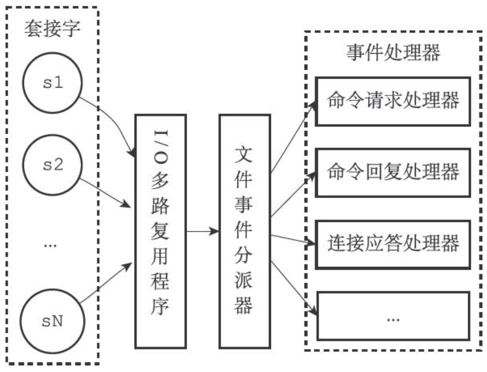

Redis服务器是一个事件驱动程序，服务器需要处理以下两类事件：
- 文件事件（file event）：Redis服务器通过套接字与客户端（或者其他Redis服务器）进行连接，而文件事件就是服务器对套接字操作的抽象。服务器与客户端（或者其他服务器）的通信会产生相应的文件事件，而服务器则通过监听并处理这些事件来完成一系列网络通信操作。
- 时间事件（time event）：Redis服务器中的一些操作（比如serverCron函数）需要在给定的时间点执行，而时间事件就是服务器对这类定时操作的抽象。

## 文件事件
Redis基于Reactor模式开发了自己的网络事件处理器：这个处理器被称为文件事件处理器（file event handler）：
- 文件事件处理器使用I/O多路复用（multiplexing）程序来同时监听多个套接字，并根据套接字目前执行的任务来为套接字关联不同的事件处理器。
- 当被监听的套接字准备好执行连接应答（accept）、读取（read）、写入（write）、关闭（close）等操作时，与操作相对应的文件事件就会产生，这时文件事件处理器就会调用套接字之前关联好的事件处理器来处理这些事件。

虽然文件事件处理器以单线程方式运行，但通过使用I/O多路复用程序来监听多个套接字，文件事件处理器既实现了高性能的网络通信模型，又可以很好地与Redis服务器中其他同样以单线程方式运行的模块进行对接，这保持了Redis内部单线程设计的简单性。

### 文件事件处理器的构成
下图展示了文件事件处理器的四个组成部分，它们分别是套接字、I/O多路复用程序、文件事件分派器（dispatcher），以及事件处理器。


文件事件是对套接字操作的抽象，每当一个套接字准备好执行连接应答（accept）、写入、读取、关闭等操作时，就会产生一个文件事件。因为一个服务器通常会连接多个套接字，所以多个文件事件有可能会并发地出现。

I/O多路复用程序负责监听多个套接字，并向文件事件分派器传送那些产生了事件的套接字。

文件事件分派器接收I/O多路复用程序传来的套接字，并根据套接字产生的事件的类型，调用相应的事件处理器。

服务器会为执行不同任务的套接字关联不同的事件处理器，这些处理器是一个个函数，它们定义了某个事件发生时，服务器应该执行的动作。

### I/O多路复用程序的实现
Redis的I/O多路复用程序的所有功能都是通过包装常见的select、epoll、evport和kqueue这些I/O多路复用函数库来实现的，每个I/O多路复用函数库在Redis源码中都对应一个单独的文件，比如ae_select.c、ae_epoll.c、ae_kqueue.c，诸如此类。

因为Redis为每个I/O多路复用函数库都实现了相同的API，所以I/O多路复用程序的底层实现是可以互换的。

Redis在I/O多路复用程序的实现源码中用#include宏定义了相应的规则，程序会在编译时自动选择系统中性能最高的I/O多路复用函数库来作为Redis的I/O多路复用程序的底层实现：

```c
/* Include the best multiplexing layer supported by this system.
* The following should be ordered by performances, descending. */
# ifdef HAVE_EVPORT
# include "ae_evport.c"
# else
    # ifdef HAVE_EPOLL
    # include "ae_epoll.c"
    # else
        # ifdef HAVE_KQUEUE
        # include "ae_kqueue.c"
        # else
        # include "ae_select.c"
        # endif
    # endif
# endif
```

### 事件的类型
I/O多路复用程序可以监听多个套接字的ae.h/AE_READABLE事件和ae.h/AE_WRITABLE事件，这两类事件和套接字操作之间的对应关系如下：
- 当套接字变得可读时（客户端对套接字执行write操作，或者执行close操作），或者有新的可应答（acceptable）套接字出现时（客户端对服务器的监听套接字执行connect操作），套接字产生AE_READABLE事件。
- 当套接字变得可写时（客户端对套接字执行read操作），套接字产生AE_WRITABLE事件。

I/O多路复用程序允许服务器同时监听套接字的AE_READABLE事件和AE_WRITABLE事件，如果一个套接字同时产生了这两种事件，那么文件事件分派器会优先处理AE_READABLE事件，等到AE_READABLE事件处理完之后，才处理AE_WRITABLE事件。

### API
ae.c/aeCreateFileEvent函数接受一个套接字描述符、一个事件类型，以及一个事件处理器作为参数，将给定套接字的给定事件加入到I/O多路复用程序的监听范围之内，并对事件和事件处理器进行关联。

ae.c/aeDeleteFileEvent函数接受一个套接字描述符和一个监听事件类型作为参数，让I/O多路复用程序取消对给定套接字的给定事件的监听，并取消事件和事件处理器之间的关联。

ae.c/aeGetFileEvents函数接受一个套接字描述符，返回该套接字正在被监听的事件类型:
- 如果套接字没有任何事件被监听，那么函数返回AE_NONE。
- 如果套接字的读事件正在被监听，那么函数返回AE_READABLE。
- 如果套接字的写事件正在被监听，那么函数返回AE_WRITABLE。
- 如果套接字的读事件和写事件正在被监听，那么函数返回AE_READABLE|AE_WRITABLE。

ae.c/aeWait函数接受一个套接字描述符、一个事件类型和一个毫秒数为参数，在给定的时间内阻塞并等待套接字的给定类型事件产生，当事件成功产生，或者等待超时之后，函数返回。

ae.c/aeApiPoll函数接受一个sys/time.h/struct timeval结构为参数，并在指定的时间內，阻塞并等待所有被aeCreateFileEvent函数设置为监听状态的套接字产生文件事件，当有至少一个事件产生，或者等待超时后，函数返回。

ae.c/aeProcessEvents函数是**文件事件分派器**，它先调用aeApiPoll函数来等待事件产生，然后遍历所有已产生的事件，并调用相应的事件处理器来处理这些事件。

### 文件事件的处理器
Redis为文件事件编写了多个处理器，这些事件处理器分别用于实现不同的网络通信需求:
- 为了对连接服务器的各个客户端进行应答，服务器要为监听套接字关联连接应答处理器。
- 为了接收客户端传来的命令请求，服务器要为客户端套接字关联命令请求处理器。
- 为了向客户端返回命令的执行结果，服务器要为客户端套接字关联命令回复处理器。
- 当主服务器和从服务器进行复制操作时，主从服务器都需要关联特别为复制功能编写的复制处理器。

## 时间事件
Redis的时间事件分为以下两类：
- 定时事件：让一段程序在指定的时间之后执行一次。比如说，让程序X在当前时间的30毫秒之后执行一次。
- 周期性事件：让一段程序每隔指定时间就执行一次。比如说，让程序Y每隔30毫秒就执行一次。

一个时间事件主要由以下三个属性组成：
- id：服务器为时间事件创建的全局唯一ID（标识号）。ID号按从小到大的顺序递增，新事件的ID号比旧事件的ID号要大。
- when：毫秒精度的UNIX时间戳，记录了时间事件的到达（arrive）时间。
- timeProc：时间事件处理器，一个函数。当时间事件到达时，服务器就会调用相应的处理器来处理事件。

一个时间事件是定时事件还是周期性事件取决于时间事件处理器的返回值:
- 如果事件处理器返回ae.h/AE_NOMORE，那么这个事件为定时事件：该事件在达到一次之后就会被删除，之后不再到达。
- 如果事件处理器返回一个非AE_NOMORE的整数值，那么这个事件为周期性时间：当一个时间事件到达之后，服务器会根据事件处理器返回的值，对时间事件的when属性进行更新，让这个事件在一段时间之后再次到达，并以这种方式一直更新并运行下去。

目前版本的Redis只使用周期性事件，而没有使用定时事件。

### 实现
服务器将所有时间事件都放在一个无序链表中，每当时间事件执行器运行时，它就遍历整个链表，查找所有已到达的时间事件，并调用相应的事件处理器。

注意，我们说保存时间事件的链表为无序链表，指的不是链表不按ID排序，而是说，该链表不按when属性的大小排序。正因为链表没有按when属性进行排序，所以当时间事件执行器运行的时候，它必须遍历链表中的所有时间事件，这样才能确保服务器中所有已到达的时间事件都会被处理。

无序链表并不影响时间事件处理器的性能。在目前版本中，正常模式下的Redis服务器只使用serverCron一个时间事件，而在benchmark模式下，服务器也只使用两个时间事件。在这种情况下，服务器几乎是将无序链表退化成一个指针来使用，所以使用无序链表来保存时间事件，并不影响事件执行的性能。

### API
ae.c/aeCreateTimeEvent函数接受一个毫秒数milliseconds和一个时间事件处理器proc作为参数，将一个新的时间事件添加到服务器，这个新的时间事件将在当前时间的milliseconds毫秒之后到达，而事件的处理器为proc。

ae.c/aeDeleteFileEvent函数接受一个时间事件ID作为参数，然后从服务器中删除该ID所对应的时间事件。

ae.c/aeSearchNearestTimer函数返回到达时间距离当前时间最接近的那个时间事件。

ae.c/processTimeEvents函数是时间事件的执行器，这个函数会遍历所有已到达的时间事件，并调用这些事件的处理器。已到达指的是，时间事件的when属性记录的UNIX时间戳等于或小于当前时间的UNIX时间戳。

processTimeEvents函数的定义可以用以下伪代码来描述：
```python
def processTimeEvents():
    #遍历服务器中的所有时间事件
    for time_event in all_time_event():
        #检查事件是否已经到达
        if time_event.when ＜= unix_ts_now():
            #事件已到达
            #执行事件处理器，并获取返回值
            retval = time_event.timeProc()
            #如果这是一个定时事件
            if retval == AE_NOMORE:
                #那么将该事件从服务器中删除
                delete_time_event_from_server(time_event)
        #如果这是一个周期性事件
        else:
            #那么按照事件处理器的返回值更新时间事件的 when属性
            #让这个事件在指定的时间之后再次到达
            update_when(time_event, retval)
```

### 时间事件应用实例：serverCron函数
持续运行的Redis服务器需要定期对自身的资源和状态进行检查和调整，从而确保服务器可以长期、稳定地运行，这些定期操作由redis.c/serverCron函数负责执行，它的主要工作包括：
- 更新服务器的各类统计信息，比如时间、内存占用、数据库占用情况等。
- 清理数据库中的过期键值对。
- 关闭和清理连接失效的客户端。
- 尝试进行AOF或RDB持久化操作。
- 如果服务器是主服务器，那么对从服务器进行定期同步。
- 如果处于集群模式，对集群进行定期同步和连接测试。

Redis服务器以周期性事件的方式来运行serverCron函数，在服务器运行期间，每隔一段时间，serverCron就会执行一次，直到服务器关闭为止。

在Redis2.6版本，服务器默认规定serverCron每秒运行10次，平均每间隔100毫秒运行一次。

## 事件的调度与执行
因为服务器中同时存在文件事件和时间事件两种事件类型，所以服务器必须对这两种事件进行调度，决定何时应该处理文件事件，何时又应该处理时间事件，以及花多少时间来处理它们等等。

事件的调度和执行由ae.c/aeProcessEvents函数负责，以下是该函数的伪代码表示：
```python
def aeProcessEvents():
    #获取到达时间离当前时间最接近的时间事件
    time_event = aeSearchNearestTimer()
    #计算最接近的时间事件距离到达还有多少毫秒
    remaind_ms = time_event.when - unix_ts_now()
    #如果事件已到达，那么remaind_ms的值可能为负数，将它设定为0
    if remaind_ms ＜ 0:
        remaind_ms = 0
    #根据remaind_ms的值，创建timeval结构
    timeval = create_timeval_with_ms(remaind_ms)
    #阻塞并等待文件事件产生，最大阻塞时间由传入的timeval结构决定
    #如果remaind_ms的值为0，那么aeApiPoll调用之后马上返回，不阻塞
    aeApiPoll(timeval)
    #处理所有已产生的文件事件
    processFileEvents()
    #处理所有已到达的时间事件
    processTimeEvents()
```

将aeProcessEvents函数置于一个循环里面，加上初始化和清理函数，这就构成了Redis服务器的主函数，以下是该函数的伪代码表示：
```python
def main():
    #初始化服务器
    init_server()
    #一直处理事件，直到服务器关闭为止
    while server_is_not_shutdown():
        aeProcessEvents()
    #服务器关闭，执行清理操作
    clean_server()
```

以下是事件的调度和执行规则：
- aeApiPoll函数的最大阻塞时间由到达时间最接近当前时间的时间事件决定，这个方法既可以避免服务器对时间事件进行频繁的轮询（忙等待），也可以确保aeApiPoll函数不会阻塞过长时间。
- 因为文件事件是随机出现的，如果等待并处理完一次文件事件之后，仍未有任何时间事件到达，那么服务器将再次等待并处理文件事件。随着文件事件的不断执行，时间会逐渐向时间事件所设置的到达时间逼近，并最终来到到达时间，这时服务器就可以开始处理到达的时间事件了。
- 对文件事件和时间事件的处理都是同步、有序、原子地执行的，服务器不会中途中断事件处理，也不会对事件进行抢占，因此，不管是文件事件的处理器，还是时间事件的处理器，它们都会尽可地减少程序的阻塞时间，并在有需要时主动让出执行权，从而降低造成事件饥饿的可能性。比如说，在命令回复处理器将一个命令回复写入到客户端套接字时，如果写入字节数超过了一个预设常量的话，命令回复处理器就会主动用break跳出写入循环，将余下的数据留到下次再写；另外，时间事件也会将非常耗时的持久化操作放到子线程或者子进程执行。
- 因为时间事件在文件事件之后执行，并且事件之间不会出现抢占，所以时间事件的实际处理时间，通常会比时间事件设定的到达时间稍晚一些。

## 重点回顾
- Redis服务器是一个事件驱动程序，服务器处理的事件分为时间事件和文件事件两类。
- 文件事件处理器是基于Reactor模式实现的网络通信程序。
- 文件事件是对套接字操作的抽象：每次套接字变为可应答（acceptable）、可写（writable）或者可读（readable）时，相应的文件事件就会产生。
- 文件事件分为AE_READABLE事件（读事件）和AE_WRITABLE事件（写事件）两类。
- 时间事件分为定时事件和周期性事件：定时事件只在指定的时间到达一次，而周期性事件则每隔一段时间到达一次。
- 服务器在一般情况下只执行serverCron函数一个时间事件，并且这个事件是周期性事件。
- 文件事件和时间事件之间是合作关系，服务器会轮流处理这两种事件，并且处理事件的过程中也不会进行抢占。❑时间事件的实际处理时间通常会比设定的到达时间晚一些。
