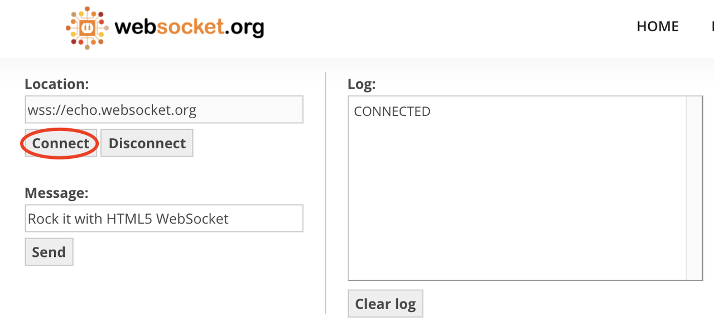

# Websocket介绍


## 什么是WebSocket？
WebSocket是一种网络传输协议，可在单个TCP连接上进行全双工通信，位于OSI模型的应用层。WebSocket协议在2011年由IETF标准化为RFC 6455，后由RFC 7936补充规范。

WebSocket使得客户端和服务器之间的数据交换变得更加简单，允许服务端主动向客户端推送数据。在WebSocket API中，浏览器和服务器只需要完成一次握手，两者之间就可以创建持久性的连接，并进行双向数据传输。

### 有哪些优点？
1. 较少的控制开销。在连接创建后，服务器和客户端之间交换数据时，用于协议控制的数据包头部相对较小。在不包含扩展的情况下，对于服务器到客户端的内容，此头部大小只有2至10字节（和数据包长度有关）；对于客户端到服务器的内容，此头部还需要加上额外的4字节的掩码。相对于HTTP请求每次都要携带完整的头部，此项开销显著减少了。
2. 强的实时性。由于协议是全双工的，所以服务器可以随时主动给客户端下发数据。相对于HTTP请求需要等待客户端发起请求服务端才能响应，延迟明显更少；即使是和Comet等类似的长轮询比较，其也能在短时间内更多次地传递数据。
3. 保持连接状态。与HTTP不同的是，Websocket需要先创建连接，这就使得其成为一种有状态的协议，之后通信时可以省略部分状态信息。而HTTP请求可能需要在每个请求都携带状态信息（如身份认证等）。
4. 更好的二进制支持。Websocket定义了二进制帧，相对HTTP，可以更轻松地处理二进制内容。
5. 可以支持扩展。Websocket定义了扩展，用户可以扩展协议、实现部分自定义的子协议。如部分浏览器支持压缩等。

<!-- more -->

## 握手协议
WebSocket是一种与HTTP不同的协议。两者都位于OSI模型的应用层，并且都依赖于传输层的TCP协议。 虽然它们不同，但是RFC 6455中规定：it is designed to work over HTTP ports 80 and 443 as well as to support HTTP proxies and intermediaries（WebSocket通过HTTP端口80和443进行工作，并支持HTTP代理和中介），从而使其与HTTP协议兼容。 为了实现兼容性，WebSocket握手使用HTTP Upgrade头从HTTP协议更改为WebSocket协议。

### 握手例子
一个典型的Websocket握手请求如下：

客户端请求：
```
GET /chat HTTP/1.1
Host: server.example.com
Upgrade: websocket
Connection: Upgrade
Sec-WebSocket-Key: dGhlIHNhbXBsZSBub25jZQ==
Origin: http://example.com
Sec-WebSocket-Protocol: chat, superchat
Sec-WebSocket-Version: 13
```

服务器回应：
```
HTTP/1.1 101 Switching Protocols
Upgrade: websocket
Connection: Upgrade
Sec-WebSocket-Accept: s3pPLMBiTxaQ9kYGzzhZRbK+xOo=
Sec-WebSocket-Protocol: chat
```


### 字段说明
- Connection必须设置Upgrade，表示客户端希望连接升级。
- Upgrade字段必须设置Websocket，表示希望升级到Websocket协议。
- Sec-WebSocket-Key是随机的字符串，服务器端会用这些数据来构造出一个SHA-1的信息摘要。把“Sec-WebSocket-Key”加上一个特殊字符串“258EAFA5-E914-47DA-95CA-C5AB0DC85B11”，然后计算SHA-1摘要，之后进行Base64编码，将结果做为“Sec-WebSocket-Accept”头的值，返回给客户端。如此操作，可以尽量避免普通HTTP请求被误认为Websocket协议。
- Sec-WebSocket-Version 表示支持的Websocket版本。RFC6455要求使用的版本是13，之前草案的版本均应当弃用。
- Origin字段是必须的。如果缺少origin字段，WebSocket服务器需要回复HTTP 403 状态码（禁止访问）。

### 体验一下
> https://www.websocket.org/echo.html




握手报文：


数据传输：


## 数据帧
WebSocket客户端、服务端通信的最小单位是帧（frame），由1个或多个帧组成一条完整的消息（message）。
- 发送端：将消息切割成多个帧，并发送给服务端；
- 接收端：接收消息帧，并将关联的帧重新组装成完整的消息；

### 帧结构
```
 +-+-+-+-+-------+-+-------------+-------------------------------+
 |F|R|R|R| opcode|M| Payload len |    Extended payload length    |
 |I|S|S|S|  (4)  |A|     (7)     |             (16/64)           |
 |N|V|V|V|       |S|             |   (if payload len==126/127)   |
 | |1|2|3|       |K|             |                               |
 +-+-+-+-+-------+-+-------------+ - - - - - - - - - - - - - - - +
 |     Extended payload length continued, if payload len == 127  |
 + - - - - - - - - - - - - - - - +-------------------------------+
 |                               |Masking-key, if MASK set to 1  |
 +-------------------------------+-------------------------------+
 | Masking-key (continued)       |          Payload Data         |
 +-------------------------------- - - - - - - - - - - - - - - - +
 :                     Payload Data continued ...                :
 + - - - - - - - - - - - - - - - - - - - - - - - - - - - - - - - +
 |                     Payload Data continued ...                |
 +---------------------------------------------------------------+
```

### 字段说明
FIN：1个比特。
如果是1，表示这是消息（message）的最后一个分片（fragment），如果是0，表示不是是消息（message）的最后一个分片（fragment）。

RSV1, RSV2, RSV3：各占1个比特。
一般情况下全为0。当客户端、服务端协商采用WebSocket扩展时，这三个标志位可以非0，且值的含义由扩展进行定义。如果出现非零的值，且并没有采用WebSocket扩展，连接出错。

Opcode: 4个比特。
操作代码，Opcode的值决定了应该如何解析后续的数据载荷（data payload）。如果操作代码是不认识的，那么接收端应该断开连接（fail the connection）。可选的操作代码如下：
- %x0：表示一个延续帧。当Opcode为0时，表示本次数据传输采用了数据分片，当前收到的数据帧为其中一个数据分片。
- %x1：表示这是一个文本帧（frame）
- %x2：表示这是一个二进制帧（frame）
- %x3-7：保留的操作代码，用于后续定义的非控制帧。
- %x8：表示连接断开。
- %x9：表示这是一个ping操作。
- %xA：表示这是一个pong操作。
- %xB-F：保留的操作代码，用于后续定义的控制帧。

Mask: 1个比特。
表示是否要对数据载荷进行掩码操作。从客户端向服务端发送数据时，需要对数据进行掩码操作；从服务端向客户端发送数据时，不需要对数据进行掩码操作。
如果服务端接收到的数据没有进行过掩码操作，服务端需要断开连接。
如果Mask是1，那么在Masking-key中会定义一个掩码键（masking key），并用这个掩码键来对数据载荷进行反掩码。所有客户端发送到服务端的数据帧，Mask都是1。
掩码的算法、用途在下一小节讲解。

Payload length：数据载荷的长度，单位是字节。为7位，或7+16位，或1+64位。
假设数Payload length === x，如果
- x为0~126：数据的长度为x字节。
- x为126：后续2个字节代表一个16位的无符号整数，该无符号整数的值为数据的长度。
- x为127：后续8个字节代表一个64位的无符号整数（最高位为0），该无符号整数的值为数据的长度。

此外，如果payload length占用了多个字节的话，payload length的二进制表达采用网络序（big endian，重要的位在前）。

Masking-key：0或4字节（32位）
所有从客户端传送到服务端的数据帧，数据载荷都进行了掩码操作，Mask为1，且携带了4字节的Masking-key。如果Mask为0，则没有Masking-key。
备注：载荷数据的长度，不包括mask key的长度。

Payload data：(x+y) 字节
- 载荷数据：包括了扩展数据、应用数据。其中，扩展数据x字节，应用数据y字节。
- 扩展数据：如果没有协商使用扩展的话，扩展数据数据为0字节。所有的扩展都必须声明扩展数据的长度，或者可以如何计算出扩展数据的长度。此外，扩展如何使用必须在握手阶段就协商好。如果扩展数据存在，那么载荷数据长度必须将扩展数据的长度包含在内。
- 应用数据：任意的应用数据，在扩展数据之后（如果存在扩展数据），占据了数据帧剩余的位置。载荷数据长度 减去 扩展数据长度，就得到应用数据的长度。

### 掩码算法
掩码键（Masking-key）是由客户端挑选出来的32位的随机数。掩码操作不会影响数据载荷的长度。掩码、反掩码操作都采用如下算法： 

首先，预设：
- original-octet-i：为原始数据的第i字节。
- transformed-octet-i：为转换后的数据的第i字节。
- j：为i mod 4的结果。
- masking-key-octet-j：为mask key第j字节。

流程为： original-octet-i 与 masking-key-octet-j 异或后，得到 transformed-octet-i。

伪代码大概是：
```
var DECODED = "";
for (var i = 0; i < ENCODED.length; i++) {
    DECODED[i] = ENCODED[i] ^ MASK[i % 4];
}
```

数据掩码的作用：
WebSocket 协议中，数据掩码的作用是增强协议的安全性。但数据掩码并不是为了保护数据本身，因为算法本身是公开的，运算也不复杂。除了加密通道本身，似乎没有太多有效的保护通信安全的办法。
那么为什么还要引入掩码计算呢，除了增加计算机器的运算量外似乎并没有太多的收益（这也是不少同学疑惑的点）。
答案还是两个字：安全。但并不是为了防止数据泄密，而是为了防止早期版本的协议中存在的代理缓存污染攻击（proxy cache poisoning attacks）等问题。

## 数据传递
一旦WebSocket客户端、服务端建立连接后，后续的操作都是基于数据帧的传递。
WebSocket根据opcode来区分操作的类型。比如0x8表示断开连接，0x0-0x2表示数据交互。

### 数据分片
WebSocket的每条消息可能被切分成多个数据帧。当WebSocket的接收方收到一个数据帧时，会根据FIN的值来判断，是否已经收到消息的最后一个数据帧。
FIN=1表示当前数据帧为消息的最后一个数据帧，此时接收方已经收到完整的消息，可以对消息进行处理。FIN=0，则接收方还需要继续监听接收其余的数据帧。
此外，opcode在数据交换的场景下，表示的是数据的类型。0x01表示文本，0x02表示二进制。而0x00比较特殊，表示延续帧（continuation frame），顾名思义，就是完整消息对应的数据帧还没接收完。

### 数据分片例子
下面例子来自MDN，可以很好地演示数据的分片。客户端向服务端两次发送消息，服务端收到消息后回应客户端，这里主要看客户端往服务端发送的消息。

*第一条消息*

FIN=1, 表示是当前消息的最后一个数据帧。服务端收到当前数据帧后，可以处理消息。opcode=0x1，表示客户端发送的是文本类型。

*第二条消息*
1. FIN=0，opcode=0x1，表示发送的是文本类型，且消息还没发送完成，还有后续的数据帧。
2. FIN=0，opcode=0x0，表示消息还没发送完成，还有后续的数据帧，当前的数据帧需要接在上一条数据帧之后。
3. FIN=1，opcode=0x0，表示消息已经发送完成，没有后续的数据帧，当前的数据帧需要接在上一条数据帧之后。服务端可以将关联的数据帧组装成完整的消息。
```
Client: FIN=1, opcode=0x1, msg="hello"
Server: (process complete message immediately) Hi.
Client: FIN=0, opcode=0x1, msg="and a"
Server: (listening, new message containing text started)
Client: FIN=0, opcode=0x0, msg="happy new"
Server: (listening, payload concatenated to previous message)
Client: FIN=1, opcode=0x0, msg="year!"
Server: (process complete message) Happy new year to you too!
```

## 心跳
WebSocket 为了保持客户端、服务端的实时双向通信，需要确保客户端、服务端之间的 TCP 通道保持连接没有断开。
对于长时间没有数据往来的连接，如果依旧长时间保持着，可能会浪费包括的连接资源。但不排除有些场景，客户端、服务端虽然长时间没有数据往来，但仍需要保持连接。这个时候，可以采用心跳来实现。
- 发送方 -> 接收方：ping
- 接收方 -> 发送方：pong

ping、pong 的操作，对应的是 WebSocket 的两个控制帧，opcode分别是0x9、0xA。

## 安全性
WebSocket协议中规定在连接建立时检查Upgrade请求中的某些字段（如Origin，查看每次请求是否一致），对于不符合要求的请求立即断开，在通信过程中，也对Frame中的控制位做了很多限制，以便禁止异常连接。
websocket协议中也规定了数据加密传输的方式，允许使用TLS/SSL来对通信加密，默认ws的端口为80，wss端口为433，类似HTTP与HTTPS。

## Go实战：Gorilla WebSocket
> Github：https://github.com/gorilla/websocket

文件监控例子（当文件被修改后，把文件发给客户端）：
```
func main() {
   http.HandleFunc("/ws", serveWs)
   if err := http.ListenAndServe(*addr, nil); err != nil {
      log.Fatal(err)
   }
}

func serveWs(w http.ResponseWriter, r *http.Request) {
   //升级为Websocket协议
   ws, err := upgrader.Upgrade(w, r, nil)
   if err != nil {
      if _, ok := err.(websocket.HandshakeError); !ok {
         log.Println(err)
      }
      return
   }

   var lastMod time.Time
   if n, err := strconv.ParseInt(r.FormValue("lastMod"), 16, 64); err == nil {
      lastMod = time.Unix(0, n)
   }

   go writer(ws, lastMod) //发送数据、Pong
   reader(ws) //读数据、处理Ping
}

func writer(ws *websocket.Conn, lastMod time.Time) {
   pingTicker := time.NewTicker(pingPeriod)
   fileTicker := time.NewTicker(filePeriod)
   ...
   for {
      select {
      case <-fileTicker.C:
         p, fileModified, err := readFileIfModified(lastMod)
         ...
         if fileModified {
            ws.SetWriteDeadline(time.Now().Add(writeWait))
            if err := ws.WriteMessage(websocket.TextMessage, p); err != nil {
               return
            }
         }
      case <-pingTicker.C:
         ws.SetWriteDeadline(time.Now().Add(writeWait))
         if err := ws.WriteMessage(websocket.PingMessage, []byte{}); err != nil {
            return
         }
      }
   }
}

func reader(ws *websocket.Conn) {
   defer ws.Close()
   ws.SetReadLimit(512)
   ws.SetReadDeadline(time.Now().Add(pongWait))
   ws.SetPongHandler(func(string) error { ws.SetReadDeadline(time.Now().Add(pongWait)); return nil })
   for {
      _, _, err := ws.ReadMessage()
      if err != nil {
         break
      }
   }
}
```

其中最重要的几个方法是Upgrade、ReadMessage和WriteMessage，下面逐一介绍。

### Upgrade
协议升级
```
// Upgrade upgrades the HTTP server connection to the WebSocket protocol.
func (u *Upgrader) Upgrade(w http.ResponseWriter, r *http.Request, responseHeader http.Header) (*Conn, error) {
   const badHandshake = "websocket: the client is not using the websocket protocol: "
   //检查必要的头部字段
   if !tokenListContainsValue(r.Header, "Connection", "upgrade") {
      return u.returnError(w, r, http.StatusBadRequest, badHandshake+"'upgrade' token not found in 'Connection' header")
   }

   if !tokenListContainsValue(r.Header, "Upgrade", "websocket") {
      return u.returnError(w, r, http.StatusBadRequest, badHandshake+"'websocket' token not found in 'Upgrade' header")
   }

   if r.Method != "GET" {
      return u.returnError(w, r, http.StatusMethodNotAllowed, badHandshake+"request method is not GET")
   }

   if !tokenListContainsValue(r.Header, "Sec-Websocket-Version", "13") {
      return u.returnError(w, r, http.StatusBadRequest, "websocket: unsupported version: 13 not found in 'Sec-Websocket-Version' header")
   }

   if !checkOrigin(r) {
      return u.returnError(w, r, http.StatusForbidden, "websocket: request origin not allowed by Upgrader.CheckOrigin")
   }

   challengeKey := r.Header.Get("Sec-Websocket-Key")
   if challengeKey == "" {
      return u.returnError(w, r, http.StatusBadRequest, "websocket: not a websocket handshake: 'Sec-WebSocket-Key' header is missing or blank")
   }

   h, ok := w.(http.Hijacker)
   if !ok {
      return u.returnError(w, r, http.StatusInternalServerError, "websocket: response does not implement http.Hijacker")
   }
   
   //创建websocket.Conn
   c := newConn(netConn, true, u.ReadBufferSize, u.WriteBufferSize, u.WriteBufferPool, br, writeBuf)
 
   var p []byte
   p = append(p, "HTTP/1.1 101 Switching Protocols\r\nUpgrade: websocket\r\nConnection: Upgrade\r\nSec-WebSocket-Accept: "...)
   p = append(p, computeAcceptKey(challengeKey)...) //计算accept
   p = append(p, "\r\n"...)
   if c.subprotocol != "" {
      p = append(p, "Sec-WebSocket-Protocol: "...)
      p = append(p, c.subprotocol...)
      p = append(p, "\r\n"...)
   }

   if _, err = netConn.Write(p); err != nil {
      netConn.Close()
      return nil, err
   }

   return c, nil
}

var keyGUID = []byte("258EAFA5-E914-47DA-95CA-C5AB0DC85B11")
func computeAcceptKey(challengeKey string) string {
   h := sha1.New()
   h.Write([]byte(challengeKey))
   h.Write(keyGUID)
   return base64.StdEncoding.EncodeToString(h.Sum(nil))
}

func newConn(conn net.Conn, isServer bool, readBufferSize, writeBufferSize int, writeBufferPool BufferPool, br *bufio.Reader, writeBuf []byte) *Conn {
   c := &Conn{
      isServer:               isServer,
      br:                     br,
      conn:                   conn,
      mu:                     mu,
      readFinal:              true,
      writeBuf:               writeBuf,
      writePool:              writeBufferPool,
      writeBufSize:           writeBufferSize,
      enableWriteCompression: true,
      compressionLevel:       defaultCompressionLevel,
   }
   
   //设置对应的消息处理Handler
   c.SetCloseHandler(nil)
   c.SetPingHandler(nil)
   c.SetPongHandler(nil)
   return c
}

func (c *Conn) SetCloseHandler(h func(code int, text string) error) {
   if h == nil {
      h = func(code int, text string) error {
         message := FormatCloseMessage(code, "")
         c.WriteControl(CloseMessage, message, time.Now().Add(writeWait))
         return nil
      }
   }
   c.handleClose = h
}

func (c *Conn) SetPingHandler(h func(appData string) error) {
   if h == nil {
      h = func(message string) error {
         err := c.WriteControl(PongMessage, []byte(message), time.Now().Add(writeWait))
         return err
      }
   }
   c.handlePing = h
}

func (c *Conn) SetPongHandler(h func(appData string) error) {
   if h == nil {
      h = func(string) error { return nil }
   }
   c.handlePong = h
}
```

### ReadMessage
```
func (c *Conn) ReadMessage() (messageType int, p []byte, err error) {
   var r io.Reader
   messageType, r, err = c.NextReader()
   if err != nil {
      return messageType, nil, err
   }
   p, err = ioutil.ReadAll(r)
   return messageType, p, err
}

func (c *Conn) NextReader() (messageType int, r io.Reader, err error) {
   for c.readErr == nil {
       frameType, err := c.advanceFrame()
       if err != nil {
          c.readErr = hideTempErr(err)
          break
       }
    
       if frameType == TextMessage || frameType == BinaryMessage {
          c.messageReader = &messageReader{c}
          c.reader = c.messageReader
          if c.readDecompress {
             c.reader = c.newDecompressionReader(c.reader)
          }
          return frameType, c.reader, nil
       }
    }
}

//解析数据帧
func (c *Conn) advanceFrame() (int, error) {
   p, err := c.read(2)
   final := p[0]&finalBit != 0
   frameType := int(p[0] & 0xf)
   mask := p[1]&maskBit != 0
   c.setReadRemaining(int64(p[1] & 0x7f))


   switch frameType {
   case CloseMessage, PingMessage, PongMessage:
      if c.readRemaining > maxControlFramePayloadSize {
         return noFrame, c.handleProtocolError("control frame length > 125")
      }
      if !final {
         return noFrame, c.handleProtocolError("control frame not final")
      }
   case TextMessage, BinaryMessage:
      if !c.readFinal {
         return noFrame, c.handleProtocolError("message start before final message frame")
      }
      c.readFinal = final
   case continuationFrame:
      if c.readFinal {
         return noFrame, c.handleProtocolError("continuation after final message frame")
      }
      c.readFinal = final
   default:
      return noFrame, c.handleProtocolError("unknown opcode " + strconv.Itoa(frameType))
   }

   
   switch c.readRemaining {
   case 126:
      p, err := c.read(2)
      if err := c.setReadRemaining(int64(binary.BigEndian.Uint16(p))); err != nil {
         return noFrame, err
      }
   case 127:
      p, err := c.read(8)
      if err != nil {
         return noFrame, err
      }

      if err := c.setReadRemaining(int64(binary.BigEndian.Uint64(p))); err != nil {
         return noFrame, err
      }
   }

   if mask != c.isServer {
      return noFrame, c.handleProtocolError("incorrect mask flag")
   }

   if mask {
      c.readMaskPos = 0
      p, err := c.read(len(c.readMaskKey))
      if err != nil {
         return noFrame, err
      }
      copy(c.readMaskKey[:], p)
   }

   //处理控制帧
   switch frameType {
   case PongMessage:
      if err := c.handlePong(string(payload)); err != nil {
         return noFrame, err
      }
   case PingMessage:
      if err := c.handlePing(string(payload)); err != nil {
         return noFrame, err
      }
   case CloseMessage:
      closeCode := CloseNoStatusReceived
      closeText := ""
      if len(payload) >= 2 {
         closeCode = int(binary.BigEndian.Uint16(payload))
         if !isValidReceivedCloseCode(closeCode) {
            return noFrame, c.handleProtocolError("invalid close code")
         }
         closeText = string(payload[2:])
         if !utf8.ValidString(closeText) {
            return noFrame, c.handleProtocolError("invalid utf8 payload in close frame")
         }
      }
      if err := c.handleClose(closeCode, closeText); err != nil {
         return noFrame, err
      }
      return noFrame, &CloseError{Code: closeCode, Text: closeText}
   }

   return frameType, nil
}
```

### WriteMessage
```
func (c *Conn) WriteMessage(messageType int, data []byte) error {
   var mw messageWriter
   // beginMessage prepares a connection and message writer for a new message.
    if err := c.beginMessage(&mw, messageType); err != nil {
       return err
    }
    n := copy(c.writeBuf[mw.pos:], data)
    mw.pos += n
    data = data[n:]
    return mw.flushFrame(true, data)
}

//组装数据帧
func (w *messageWriter) flushFrame(final bool, extra []byte) error {
   c := w.c
   length := w.pos - maxFrameHeaderSize + len(extra)

   b0 := byte(w.frameType)
   if final {
      b0 |= finalBit
   }
   if w.compress {
      b0 |= rsv1Bit
   }
   w.compress = false

   b1 := byte(0)
   if !c.isServer {
      b1 |= maskBit
   }

   // Assume that the frame starts at beginning of c.writeBuf.
   framePos := 0
   if c.isServer {
      // Adjust up if mask not included in the header.
      framePos = 4
   }

   switch {
   case length >= 65536:
      c.writeBuf[framePos] = b0
      c.writeBuf[framePos+1] = b1 | 127
      binary.BigEndian.PutUint64(c.writeBuf[framePos+2:], uint64(length))
   case length > 125:
      framePos += 6
      c.writeBuf[framePos] = b0
      c.writeBuf[framePos+1] = b1 | 126
      binary.BigEndian.PutUint16(c.writeBuf[framePos+2:], uint16(length))
   default:
      framePos += 8
      c.writeBuf[framePos] = b0
      c.writeBuf[framePos+1] = b1 | byte(length)
   }

   if !c.isServer {
      key := newMaskKey()
      copy(c.writeBuf[maxFrameHeaderSize-4:], key[:])
      maskBytes(key, 0, c.writeBuf[maxFrameHeaderSize:w.pos])
      if len(extra) > 0 {
         return w.endMessage(c.writeFatal(errors.New("websocket: internal error, extra used in client mode")))
      }
   }

   // Write the buffers to the connection with best-effort detection of
   // concurrent writes. See the concurrency section in the package
   // documentation for more info.

   if c.isWriting {
      panic("concurrent write to websocket connection")
   }
   c.isWriting = true

   err := c.write(w.frameType, c.writeDeadline, c.writeBuf[framePos:w.pos], extra)

   ...
   return nil
}
```

Ref：
- https://datatracker.ietf.org/doc/html/rfc6455#
- https://zh.wikipedia.org/wiki/WebSocket
- http://www.ruanyifeng.com/blog/2017/05/websocket.html
- https://pkg.go.dev/github.com/gorilla/websocket


---

> 作者: [chuxing](https://github.com/xzygis)  
> URL: https://xzygis.github.io/posts/introduction-of-websocket/  

