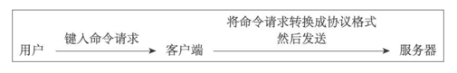

# Redis 服务器


Redis服务器负责与多个客户端建立网络连接，处理客户端发送的命令请求，在数据库中保存客户端执行命令所产生的数据，并通过资源管理来维持服务器自身的运转。

## 命令请求的执行过程
### 发送命令请求
Redis服务器的命令请求来自Redis客户端，当用户在客户端中键入一个命令请求时，客户端会将这个命令请求转换成协议格式，然后通过连接到服务器的套接字，将协议格式的命令请求发送给服务器。



举个例子，假设用户在客户端键入了命令：
```shell
SET KEY VALUE
```
那么客户端会将这个命令转换成协议：
```shell
*3\r\n$3\r\nSET\r\n$3\r\nKEY\r\n$5\r\nVALUE\r\n
```
然后将这段协议内容发送给服务器。

### 读取命令请求
当客户端与服务器之间的连接套接字因为客户端的写入而变得可读时，服务器将调用命令请求处理器来执行以下操作：
1. 读取套接字中协议格式的命令请求，并将其保存到客户端状态的输入缓冲区里面。
2. 对输入缓冲区中的命令请求进行分析，提取出命令请求中包含的命令参数，以及命令参数的个数，然后分别将参数和参数个数保存到客户端状态的argv属性和argc属性里面。
3. 调用命令执行器，执行客户端指定的命令。

### 命令执行器（1）：查找命令实现
命令执行器要做的第一件事就是根据客户端状态的argv[0]参数，在命令表（command table）中查找参数所指定的命令，并将找到的命令保存到客户端状态的cmd属性里面。

命令表是一个字典，字典的键是一个个命令名字，比如"set"、"get"、"del"等等；而字典的值则是一个个redisCommand结构，每个redisCommand结构记录了一个Redis命令的实现信息。

因为命令表使用的是大小写无关的查找算法，无论输入的命令名字是大写、小写或者混合大小写，只要命令的名字是正确的，就能找到相应的redisCommand结构。

### 命令执行器（2）：执行预备操作
到目前为止，服务器已经将执行命令所需的命令实现函数（保存在客户端状态的cmd属性）、参数（保存在客户端状态的argv属性）、参数个数（保存在客户端状态的argc属性）都收集齐了，但是在真正执行命令之前，程序还需要进行一些预备操作，从而确保命令可以正确、顺利地被执行，这些操作包括：
- 检查客户端状态的cmd指针是否指向NULL，如果是的话，那么说明用户输入的命令名字找不到相应的命令实现，服务器不再执行后续步骤，并向客户端返回一个错误。
- 根据客户端cmd属性指向的redisCommand结构的arity属性，检查命令请求所给定的参数个数是否正确，当参数个数不正确时，不再执行后续步骤，直接向客户端返回一个错误。比如说，如果redisCommand结构的arity属性的值为-3，那么用户输入的命令参数个数必须大于等于3个才行。
- 检查客户端是否已经通过了身份验证，未通过身份验证的客户端只能执行AUTH命令，如果未通过身份验证的客户端试图执行除AUTH命令之外的其他命令，那么服务器将向客户端返回一个错误。
- 如果服务器打开了maxmemory功能，那么在执行命令之前，先检查服务器的内存占用情况，并在有需要时进行内存回收，从而使得接下来的命令可以顺利执行。如果内存回收失败，那么不再执行后续步骤，向客户端返回一个错误。
- 如果服务器上一次执行BGSAVE命令时出错，并且服务器打开了stop-writes-on-bgsave-error功能，而且服务器即将要执行的命令是一个写命令，那么服务器将拒绝执行这个命令，并向客户端返回一个错误。
- 如果客户端当前正在用SUBSCRIBE命令订阅频道，或者正在用PSUBSCRIBE命令订阅模式，那么服务器只会执行客户端发来的SUBSCRIBE、PSUBSCRIBE、UNSUBSCRIBE、PUNSUBSCRIBE四个命令，其他命令都会被服务器拒绝。
- 如果服务器正在进行数据载入，那么客户端发送的命令必须带有l标识（比如INFO、SHUTDOWN、PUBLISH等等）才会被服务器执行，其他命令都会被服务器拒绝。
- 如果服务器因为执行Lua脚本而超时并进入阻塞状态，那么服务器只会执行客户端发来的SHUTDOWN nosave命令和SCRIPT KILL命令，其他命令都会被服务器拒绝。
- 如果客户端正在执行事务，那么服务器只会执行客户端发来的EXEC、DISCARD、MULTI、WATCH四个命令，其他命令都会被放进事务队列中。
- 如果服务器打开了监视器功能，那么服务器会将要执行的命令和参数等信息发送给监视器。当完成了以上预备操作之后，服务器就可以开始真正执行命令了。

### 命令执行器（3）：调用命令的实现函数
在前面的操作中，服务器已经将要执行命令的实现保存到了客户端状态的cmd属性里面，并将命令的参数和参数个数分别保存到了客户端状态的argv属性和argv属性里面，当服务器决定要执行命令时，它只要执行以下语句就可以了：
```c
// client是指向客户端状态的指针
client-＞cmd-＞proc(client);
```
被调用的命令实现函数会执行指定的操作，并产生相应的命令回复，这些回复会被保存在客户端状态的输出缓冲区里面（buf属性和reply属性），之后实现函数还会为客户端的套接字关联命令回复处理器，这个处理器负责将命令回复返回给客户端。

### 命令执行器（4）：执行后续工作
在执行完实现函数之后，服务器还需要执行一些后续工作：
- 如果服务器开启了慢查询日志功能，那么慢查询日志模块会检查是否需要为刚刚执行完的命令请求添加一条新的慢查询日志。❑
- 根据刚刚执行命令所耗费的时长，更新被执行命令的redisCommand结构的milliseconds属性，并将命令的redisCommand结构的calls计数器的值增一。
- 如果服务器开启了AOF持久化功能，那么AOF持久化模块会将刚刚执行的命令请求写入到AOF缓冲区里面。
- 如果有其他从服务器正在复制当前这个服务器，那么服务器会将刚刚执行的命令传播给所有从服务器。

当以上操作都执行完了之后，服务器对于当前命令的执行到此就告一段落了，之后服务器就可以继续从文件事件处理器中取出并处理下一个命令请求了。

### 将命令回复发送给客户端
命令实现函数会将命令回复保存到客户端的输出缓冲区里面，并为客户端的套接字关联命令回复处理器，当客户端套接字变为可写状态时，服务器就会执行命令回复处理器，将保存在客户端输出缓冲区中的命令回复发送给客户端。

当命令回复发送完毕之后，回复处理器会清空客户端状态的输出缓冲区，为处理下一个命令请求做好准备。

### 客户端接收并打印命令回复
当客户端接收到协议格式的命令回复之后，它会将这些回复转换成人类可读的格式，并打印给用户观看。

## serverCron函数
Redis服务器中的serverCron函数默认每隔100毫秒执行一次，这个函数负责管理服务器的资源，并保持服务器自身的良好运转。

### 更新服务器时间缓存
Redis服务器中有不少功能需要获取系统的当前时间，而每次获取系统的当前时间都需要执行一次系统调用，为了减少系统调用的执行次数，服务器状态中的unixtime属性和mstime属性被用作当前时间的缓存:
```c
struct redisServer {
      // ...
      //保存了秒级精度的系统当前UNIX时间戳
      time_t unixtime;
      //保存了毫秒级精度的系统当前UNIX时间戳
      long long mstime;
      // ...
};
```

因为serverCron函数默认会以每100毫秒一次的频率更新unixtime属性和mstime属性，所以这两个属性记录的时间的精确度并不高：
- 服务器只会在打印日志、更新服务器的LRU时钟、决定是否执行持久化任务、计算服务器上线时间（uptime）这类对时间精确度要求不高的功能上。
- 对于为键设置过期时间、添加慢查询日志这种需要高精确度时间的功能来说，服务器还是会再次执行系统调用，从而获得最准确的系统当前时间。

### 更新LRU时钟
服务器状态中的lruclock属性保存了服务器的LRU时钟，这个属性和上面介绍的unixtime属性、mstime属性一样，都是服务器时间缓存的一种：
```c
struct redisServer {
    // ...
    //默认每10秒更新一次的时钟缓存，
    //用于计算键的空转（idle）时长。
    unsigned lruclock:22;
    // ...
};
```
每个Redis对象都会有一个lru属性，这个lru属性保存了对象最后一次被命令访问的时间：
```c
typedef struct redisObject {
    // ...
    unsigned lru:22;
    // ...
} robj;
```
当服务器要计算一个数据库键的空转时间（也即是数据库键对应的值对象的空转时间），程序会用服务器的lruclock属性记录的时间减去对象的lru属性记录的时间，得出的计算结果就是这个对象的空转时间。

serverCron函数默认会以每10秒一次的频率更新lruclock属性的值，因为这个时钟不是实时的，所以根据这个属性计算出来的LRU时间实际上只是一个模糊的估算值。

### 更新服务器每秒执行命令次数
serverCron函数中的trackOperationsPerSecond函数会以每100毫秒一次的频率执行，这个函数的功能是以抽样计算的方式，估算并记录服务器在最近一秒钟处理的命令请求数量，这个值可以通过INFO status命令的instantaneous_ops_per_sec域查看。

trackOperationsPerSecond函数和服务器状态中四个ops_sec_开头的属性有关：
```c
struct redisServer {
    // ...
    //上一次进行抽样的时间
    long long ops_sec_last_sample_time;
    //上一次抽样时，服务器已执行命令的数量
    long long ops_sec_last_sample_ops;
    // REDIS_OPS_SEC_SAMPLES大小（默认值为16）的环形数组，
    //数组中的每个项都记录了一次抽样结果。
    long long ops_sec_samples[REDIS_OPS_SEC_SAMPLES];
    // ops_sec_samples数组的索引值，
    //每次抽样后将值自增一，
    //在值等于16时重置为0，
    //让ops_sec_samples数组构成一个环形数组。
    int ops_sec_idx;
    // ...
};
```
trackOperationsPerSecond函数每次运行，都会根据ops_sec_last_sample_time记录的上一次抽样时间和服务器的当前时间，以及ops_sec_last_sample_ops记录的上一次抽样的已执行命令数量和服务器当前的已执行命令数量，计算出两次trackOperationsPerSecond调用之间，服务器平均每一毫秒处理了多少个命令请求，然后将这个平均值乘以1000，这就得到了服务器在一秒钟内能处理多少个命令请求的估计值，这个估计值会被作为一个新的数组项被放进ops_sec_samples环形数组里面。

### 更新服务器内存峰值记录
服务器状态中的stat_peak_memory属性记录了服务器的内存峰值大小。
```c
struct redisServer {
    // ...
    //已使用内存峰值
    size_t stat_peak_memory;
    // ...
};
```

每次serverCron函数执行时，程序都会查看服务器当前使用的内存数量，并与stat_peak_memory保存的数值进行比较，如果当前使用的内存数量比stat_peak_memory属性记录的值要大，那么程序就将当前使用的内存数量记录到stat_peak_memory属性里面。

### 处理SIGTERM信号
在启动服务器时，Redis会为服务器进程的SIGTERM信号关联处理器sigtermHandler函数，这个信号处理器负责在服务器接到SIGTERM信号时，打开服务器状态的shutdown_asap标识：
```c
// SIGTERM信号的处理器
static void sigtermHandler(int sig) {
    //打印日志
    redisLogFromHandler(REDIS_WARNING,"Received SIGTERM, scheduling shutdown...");
    //打开关闭标识
    server.shutdown_asap = 1;
}
```

每次serverCron函数运行时，程序都会对服务器状态的shutdown_asap属性进行检查，并根据属性的值决定是否关闭服务器：
```c
struct redisServer {
    // ...
    //关闭服务器的标识：
    //值为1时，关闭服务器，
    //值为0时，不做动作。
    int shutdown_asap;
    // ...
};
```

以下代码展示了服务器在接到SIGTERM信号之后，关闭服务器并打印相关日志的过程：
```shell
[6794 | signal handler] (1384435690) Received SIGTERM, scheduling shutdown...
[6794] 14 Nov 21:28:10.108 # User requested shutdown...
[6794] 14 Nov 21:28:10.108 * Saving the final RDB snapshot before exiting.
[6794] 14 Nov 21:28:10.161 * DB saved on disk
[6794] 14 Nov 21:28:10.161 # Redisis now ready to exit, bye bye...
```
从日志里面可以看到，服务器在关闭自身之前会进行RDB持久化操作，这也是服务器拦截SIGTERM信号的原因，如果服务器一接到SIGTERM信号就立即关闭，那么它就没办法执行持久化操作了。

### 管理客户端资源
serverCron函数每次执行都会调用clientsCron函数，clientsCron函数会对一定数量的客户端进行以下两个检查：
- 如果客户端与服务器之间的连接已经超时（很长一段时间里客户端和服务器都没有互动），那么程序释放这个客户端。
- 如果客户端在上一次执行命令请求之后，输入缓冲区的大小超过了一定的长度，那么程序会释放客户端当前的输入缓冲区，并重新创建一个默认大小的输入缓冲区，从而防止客户端的输入缓冲区耗费了过多的内存。

### 管理数据库资源
serverCron函数每次执行都会调用databasesCron函数，这个函数会对服务器中的一部分数据库进行检查，删除其中的过期键，并在有需要时，对字典进行收缩操作。

### 执行被延迟的BGREWRITEAOF
在服务器执行BGSAVE命令的期间，如果客户端向服务器发来BGREWRITEAOF命令，那么服务器会将BGREWRITEAOF命令的执行时间延迟到BGSAVE命令执行完毕之后。

### 检查持久化操作的运行状态
服务器状态使用rdb_child_pid属性和aof_child_pid属性记录执行BGSAVE命令和BGREWRITEAOF命令的子进程的ID，这两个属性也可以用于检查BGSAVE命令或者BGREWRITEAOF命令是否正在执行。

每次serverCron函数执行时，程序都会检查rdb_child_pid和aof_child_pid两个属性的值，只要其中一个属性的值不为-1，程序就会执行一次wait3函数，检查子进程是否有信号发来服务器进程：
- 如果有信号到达，那么表示新的RDB文件已经生成完毕（对于BGSAVE命令来说），或者AOF文件已经重写完毕（对于BGREWRITEAOF命令来说），服务器需要进行相应命令的后续操作，比如用新的RDB文件替换现有的RDB文件，或者用重写后的AOF文件替换现有的AOF文件。
- 如果没有信号到达，那么表示持久化操作未完成，程序不做动作。

另一方面，如果rdb_child_pid和aof_child_pid两个属性的值都为-1，那么表示服务器没有在进行持久化操作，在这种情况下，程序执行以下三个检查：
1. 查看是否有BGREWRITEAOF被延迟了，如果有的话，那么开始一次新的BGREWRITEAOF操作（这就是上一个小节我们说到的检查）。
2. 检查服务器的自动保存条件是否已经被满足，如果条件满足，并且服务器没有在执行其他持久化操作，那么服务器开始一次新的BGSAVE操作（因为条件1可能会引发一次BGREWRITEAOF，所以在这个检查中，程序会再次确认服务器是否已经在执行持久化操作了）。
3. 检查服务器设置的AOF重写条件是否满足，如果条件满足，并且服务器没有在执行其他持久化操作，那么服务器将开始一次新的BGREWRITEAOF操作（因为条件1和条件2都可能会引起新的持久化操作，所以在这个检查中，我们要再次确认服务器是否已经在执行持久化操作了）。

### 将AOF缓冲区中的内容写入AOF文件
如果服务器开启了AOF持久化功能，并且AOF缓冲区里面还有待写入的数据，那么serverCron函数会调用相应的程序，将AOF缓冲区中的内容写入到AOF文件里面。

### 关闭异步客户端
服务器会关闭那些输出缓冲区大小超出限制的客户端

### 增加cronloops计数器的值
服务器状态的cronloops属性记录了serverCron函数执行的次数：
```c
struct redisServer {
    // ...
    // serverCron函数的运行次数计数器
    // serverCron函数每执行一次，这个属性的值就增一。
    int cronloops;
    // ...
};
```

cronloops属性目前在服务器中的唯一作用，就是在复制模块中实现“每执行serverCron函数N次就执行一次指定代码”的功能，方法如以下伪代码所示：
```c
if cronloops % N == 0:
#执行指定代码...
```

## 初始化服务器
一个Redis服务器从启动到能够接受客户端的命令请求，需要经过一系列的初始化和设置过程，比如初始化服务器状态，接受用户指定的服务器配置，创建相应的数据结构和网络连接等。

### 初始化服务器状态结构
初始化服务器的第一步就是创建一个struct redisServer类型的实例变量server作为服务器的状态，并为结构中的各个属性设置默认值。

初始化server变量的工作由redis.c/initServerConfig函数完成，以下是这个函数最开头的一部分代码：
```c
void initServerConfig(void){
    //设置服务器的运行id
    getRandomHexChars(server.runid,REDIS_RUN_ID_SIZE);
    //为运行id加上结尾字符
    server.runid[REDIS_RUN_ID_SIZE] = '\0';
    //设置默认配置文件路径
    server.configfile = NULL;
    //设置默认服务器频率
    server.hz = REDIS_DEFAULT_HZ;
    //设置服务器的运行架构
    server.arch_bits = (sizeof(long) == 8) ? 64 : 32;
    //设置默认服务器端口号
    server.port = REDIS_SERVERPORT;
    // ...
}
```

以下是initServerConfig函数完成的主要工作：
- 设置服务器的运行ID。
- 设置服务器的默认运行频率。
- 设置服务器的默认配置文件路径。
- 设置服务器的运行架构。
- 设置服务器的默认端口号。
- 设置服务器的默认RDB持久化条件和AOF持久化条件。
- 初始化服务器的LRU时钟。
- 创建命令表。

### 载入配置选项
在启动服务器时，用户可以通过给定配置参数或者指定配置文件来修改服务器的默认配置。

服务器在用initServerConfig函数初始化完server变量之后，就会开始载入用户给定的配置参数和配置文件，并根据用户设定的配置，对server变量相关属性的值进行修改。

### 初始化服务器数据结构
在之前执行initServerConfig函数初始化server状态时，程序只创建了命令表一个数据结构，不过除了命令表之外，服务器状态还包含其他数据结构，比如：
- server.clients链表，这个链表记录了所有与服务器相连的客户端的状态结构，链表的每个节点都包含了一个redisClient结构实例。
- server.db数组，数组中包含了服务器的所有数据库。
- 用于保存频道订阅信息的server.pubsub_channels字典，以及用于保存模式订阅信息的server.pubsub_patterns链表。
- 用于执行Lua脚本的Lua环境server.lua。❑用于保存慢查询日志的server.slowlog属性。

当初始化服务器进行到这一步，服务器将调用initServer函数，为以上提到的数据结构分配内存，并在有需要时，为这些数据结构设置或者关联初始化值。

服务器到现在才初始化数据结构的原因在于，服务器必须先载入用户指定的配置选项，然后才能正确地对数据结构进行初始化。

### 还原数据库状态
在完成了对服务器状态server变量的初始化之后，服务器需要载入RDB文件或者AOF文件，并根据文件记录的内容来还原服务器的数据库状态。

根据服务器是否启用了AOF持久化功能，服务器载入数据时所使用的目标文件会有所不同：
- 如果服务器启用了AOF持久化功能，那么服务器使用AOF文件来还原数据库状态。
- 相反地，如果服务器没有启用AOF持久化功能，那么服务器使用RDB文件来还原数据库状态。

### 执行事件循环
在初始化的最后一步，服务器将打印出以下日志：
```c
[5244] 21 Nov 22:43:49.084 * The server is now ready to accept connections on port 6379
```
并开始执行服务器的事件循环（loop）。

至此，服务器的初始化工作圆满完成，服务器现在开始可以接受客户端的连接请求，并处理客户端发来的命令请求了。

## 重点回顾
- 一个命令请求从发送到完成主要包括以下步骤：1）客户端将命令请求发送给服务器；2）服务器读取命令请求，并分析出命令参数；3）命令执行器根据参数查找命令的实现函数，然后执行实现函数并得出命令回复；4）服务器将命令回复返回给客户端。
- serverCron函数默认每隔100毫秒执行一次，它的工作主要包括更新服务器状态信息，处理服务器接收的SIGTERM信号，管理客户端资源和数据库状态，检查并执行持久化操作等等。
- 服务器从启动到能够处理客户端的命令请求需要执行以下步骤：1）初始化服务器状态；2）载入服务器配置；3）初始化服务器数据结构；4）还原数据库状态；5）执行事件循环。


---

> 作者:   
> URL: https://xzygis.github.io/posts/introduction-to-redis-server/  

